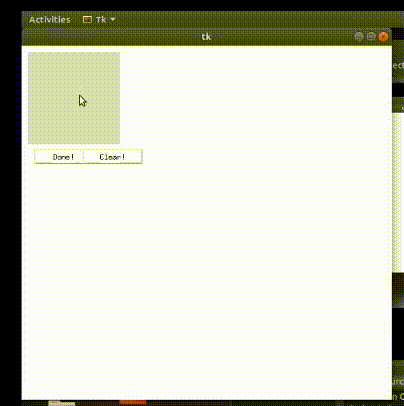
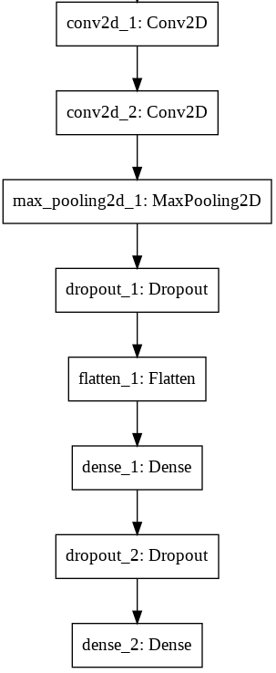

# A-real-time-digit-recognition
A real-time handwritten digit recognition using python and CNN. Allows user to write a digit on canvas and make appropriate predictions.

## Overview
In recent times convolutional neural netwoks a class of deep learning become popular and used for analyzing visual imagery. CNN's are the state of the art for various computer vision tasks like image classification, object detection, facial recognition. Digit recognition is an image classification task so, CNN can be used for image classification. Digit recognition task can be used for various real-time tasks. Preciesly can be used for vehicle number plate recognition, can read zip codes on a post, can read digits on cheques.

  
<table>
  <tr>
    <td> 
    </td>
    <td>
     </td>
  </tr>
</table>

  
## Description
This is a real time application that can predict corresponding digit. Used CNN to make predictions. Also used tkinter module to generate a canvas and allow user to write on the canvas using mouse. The written canvas is taken as a image with 200 &#215; 200 pixel. Resize image to 28 &#215; 28 pixel and feed it to CNN model with 10 layers in softmax layer to predict correct digit.

### Dataset

MNIST is a widely used dataset for the hand-written digit classification task. It consists of 70,000 labelled 28 &#215; 28 pixel grayscale images of hand-written digits. The dataset is split into 60,000 training images and 10,000 test images. There are 10 classes (one for each of the 10 digits). The task at hand is to train a model using the 60,000 training images and subsequently test its classification accuracy on the 10,000 test images.

### Sample Images
Here are some sample images from dataset.

## CNN Model
Training a CNN model is a local system without any GPU's is very costly. So, trained CNN model in google colab and exported 
model, weights to local system with keras.

### Model Architecture

## Dependencies
List of dependencies to run this application.
<ol>
  <li>numpy</li>
  <li>openCV</li>
  <li>tkinter</li>
  <li>pillow</li>
  <li>sklearn-image</li>
  <li>keras</li>
  <li>inflect</li>
</ol>

## How to use
<ol>
  <li> Download or clone this repository. </li>
  <li> Install all the dependency libraries. </li>
  <li> Run Hand written detection.py file</li>
      
 This opens a canvas to draw/write.

      
  <li>Draw digits on to canvas with mouse</li>
      
      Click and drag mouse to draw.
      Release mouse to stop drawing.
      
   <li>Click on done to predict output.</li>
   <li>Click on clear to clear canvas.</li>
</ol>
        
      
